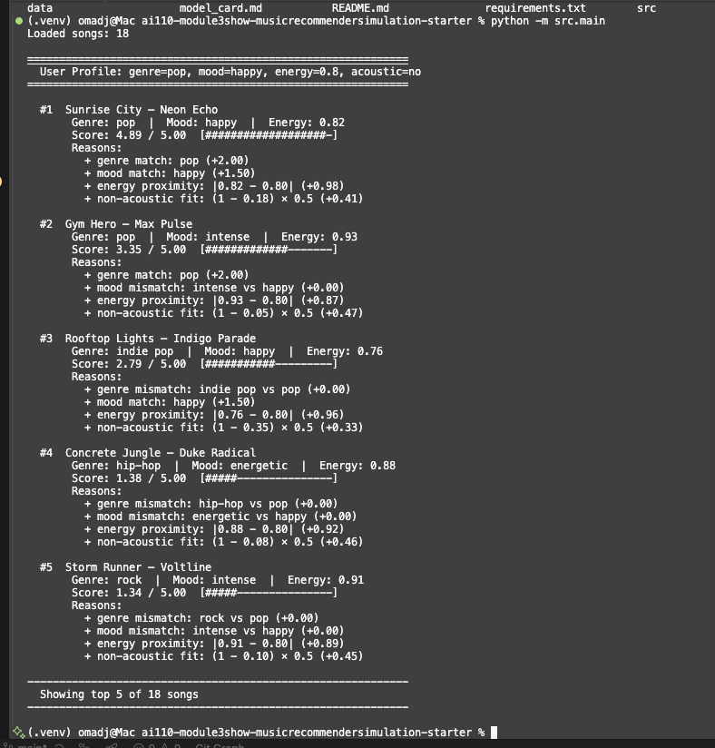
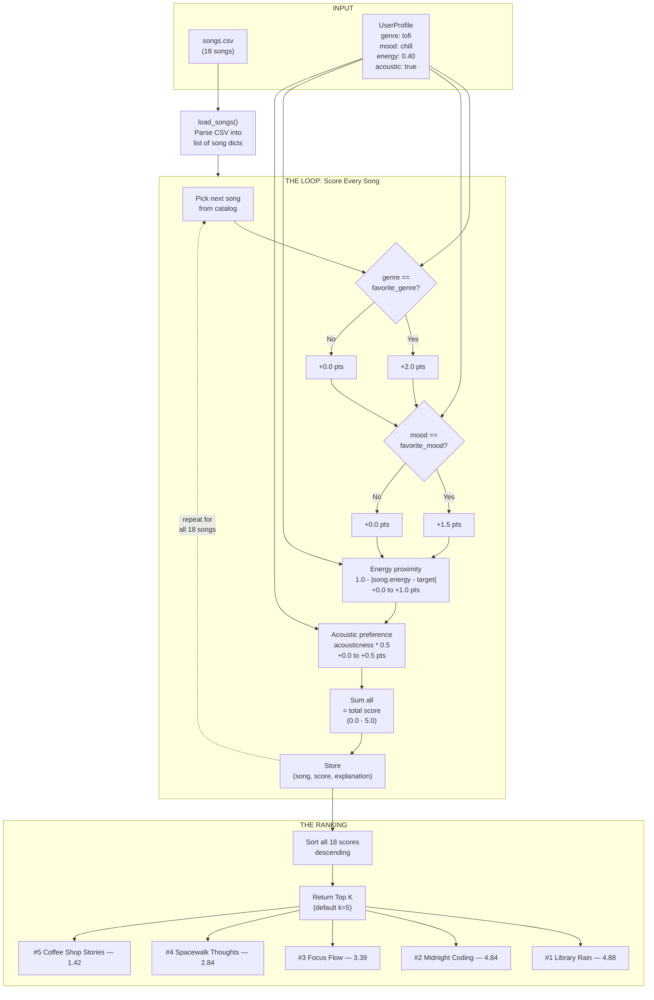

# 🎵 Music Recommender Simulation

## Project Summary

In this project you will build and explain a small music recommender system.

Your goal is to:

- Represent songs and a user "taste profile" as data
- Design a scoring rule that turns that data into recommendations
- Evaluate what your system gets right and wrong
- Reflect on how this mirrors real world AI recommenders

This project is a simplified content-based music recommender. Real-world platforms like Spotify and YouTube combine collaborative filtering (learning from millions of users' behavior) with content-based filtering (analyzing audio attributes like energy, tempo, and acousticness). Our simulation focuses on the content-based side: it scores each song against a user's taste profile using measurable features, then ranks and returns the best matches.

### Screenshot



---

## How The System Works

Real-world recommenders like Spotify use a hybrid approach: collaborative filtering finds patterns across millions of users' playlists, while content-based filtering analyzes measurable song attributes (energy, tempo, acousticness, etc.) to match tracks to a listener's taste. Our simulation prioritizes the content-based approach because it works without needing data from other users and directly connects song features to user preferences. It scores every song in the catalog against a user profile, then ranks them to surface the top matches.

### Song Features

Each `Song` object stores the following attributes from `data/songs.csv`:

| Feature | Type | Role in Scoring |
|---|---|---|
| `genre` | categorical | Exact-match bonus against user's favorite genre |
| `mood` | categorical | Exact-match bonus against user's favorite mood |
| `energy` | numeric (0.0–1.0) | Proximity score to user's target energy level |
| `acousticness` | numeric (0.0–1.0) | Compared against user's acoustic preference |
| `tempo_bpm` | numeric (60–152) | Supporting feature for tiebreaking |
| `valence` | numeric (0.0–1.0) | Available for future experiments |
| `danceability` | numeric (0.0–1.0) | Available for future experiments |

### UserProfile Features

Each `UserProfile` stores a listener's taste preferences:

- **`favorite_genre`** (str) — the genre the user prefers (e.g., "lofi", "pop")
- **`favorite_mood`** (str) — the mood the user gravitates toward (e.g., "chill", "intense")
- **`target_energy`** (float) — the user's ideal energy level, from 0.0 (calm) to 1.0 (intense)
- **`likes_acoustic`** (bool) — whether the user prefers acoustic-sounding tracks

### Scoring Rule (one song)

For each song, a weighted score is computed (0.0–5.0 scale):

```
score = genre_score + mood_score + energy_score + acoustic_score

  genre_score    = +2.0 if exact match, else 0.0        (40% of max)
  mood_score     = +1.5 if exact match, else 0.0        (30% of max)
  energy_score   = 1.0 - |song.energy - target_energy|  (20% of max)
  acoustic_score = acousticness * 0.5 (if likes acoustic)
                   (1.0 - acousticness) * 0.5 (otherwise) (10% of max)
```

### Ranking Rule (all songs)

1. Compute the score for every song in the catalog
2. Sort all songs by score in descending order
3. Return the top k songs (default k=5)

### Data Flow Diagram



### Algorithm Recipe (Finalized)

This is the complete, step-by-step recipe the program follows to produce recommendations:

**Step 1 — Load the catalog.**
Read all 18 songs from `data/songs.csv`. Parse each row into a dictionary with typed values (strings for genre/mood, floats for energy/acousticness/etc.).

**Step 2 — Define the user's taste profile.**
```python
user_prefs = {
    "favorite_genre": "lofi",
    "favorite_mood":  "chill",
    "target_energy":  0.40,
    "likes_acoustic": True,
}
```

**Step 3 — Score every song (the loop).**
For each song in the catalog, compute a total score on a 0.0–5.0 scale:

| Check | Rule | Points | Why this weight |
|---|---|---|---|
| Genre match | `song.genre == "lofi"` ? | **+2.0** or 0.0 | Users think in genres first. This is the strongest intent signal. |
| Mood match | `song.mood == "chill"` ? | **+1.5** or 0.0 | A chill jazz track is closer to chill lofi than intense lofi. Mood captures vibe. |
| Energy proximity | `1.0 - abs(song.energy - 0.40)` | **+0.0 to +1.0** | Continuous feature — rewards closeness, not just above/below a threshold. |
| Acoustic fit | `acousticness * 0.5` (or `(1 - acousticness) * 0.5`) | **+0.0 to +0.5** | Real but secondary preference. Acts as a tiebreaker between otherwise similar songs. |

**Step 4 — Rank and return.**
Sort all 18 (song, score, explanation) tuples by score descending. Return the top k (default 5).

### Known Biases and Trade-offs

This scoring design introduces several predictable biases that are important to acknowledge:

- **Genre over-prioritization.** At 40% of the max score, genre dominates. A lofi song with the wrong mood and wrong energy (score ~2.5) will still outrank a non-lofi song with perfect mood, energy, and acousticness (score ~2.5). This means the system can miss great cross-genre matches — for example, a chill jazz track like Coffee Shop Stories that *sounds* similar to lofi but gets penalized for its genre label.

- **Binary categorical scoring is blunt.** Genre and mood are scored as exact match or nothing. There is no concept of "close" — indie pop gets the same 0.0 as metal when the user prefers lofi, even though indie pop is sonically much closer. Real systems use genre embeddings or similarity matrices to handle this.

- **Filter bubble risk.** Because the system always rewards the same genre and mood, it will never surface a surprising recommendation from a genre the user hasn't tried. A user who sets `genre="lofi"` will never discover they might love ambient or jazz unless they change their profile.

- **Acoustic preference is too simple.** A boolean (`likes_acoustic: True/False`) forces every user into one of two buckets. In reality, a user might prefer acoustic for chill listening but electronic for workouts. The system has no concept of context.

- **Small catalog amplifies all biases.** With only 18 songs and 14 genres, most genres have exactly 1 song. A single bad metadata label (e.g., a song tagged "rock" that is actually acoustic folk) would significantly distort results. At scale, these errors average out; at this size, they don't.

- **No popularity or novelty signal.** The system scores purely on feature match. It cannot distinguish between a beloved classic and an obscure track, nor can it balance familiar favorites with fresh discoveries.

---

## Getting Started

### Setup

1. Create a virtual environment (optional but recommended):

   ```bash
   python -m venv .venv
   source .venv/bin/activate      # Mac or Linux
   .venv\Scripts\activate         # Windows

2. Install dependencies

```bash
pip install -r requirements.txt
```

3. Run the app:

```bash
python -m src.main
```

### Running Tests

Run the starter tests with:

```bash
pytest
```

You can add more tests in `tests/test_recommender.py`.

---

## Experiments You Tried

Use this section to document the experiments you ran. For example:

- What happened when you changed the weight on genre from 2.0 to 0.5
- What happened when you added tempo or valence to the score
- How did your system behave for different types of users

---

## Limitations and Risks

Summarize some limitations of your recommender.

Examples:

- It only works on a tiny catalog
- It does not understand lyrics or language
- It might over favor one genre or mood

You will go deeper on this in your model card.

---

## Reflection

Read and complete `model_card.md`:

[**Model Card**](model_card.md)

Write 1 to 2 paragraphs here about what you learned:

- about how recommenders turn data into predictions
- about where bias or unfairness could show up in systems like this


---

## 7. `model_card_template.md`

Combines reflection and model card framing from the Module 3 guidance. :contentReference[oaicite:2]{index=2}  

```markdown
# 🎧 Model Card - Music Recommender Simulation

## 1. Model Name

Give your recommender a name, for example:

> VibeFinder 1.0

---

## 2. Intended Use

- What is this system trying to do
- Who is it for

Example:

> This model suggests 3 to 5 songs from a small catalog based on a user's preferred genre, mood, and energy level. It is for classroom exploration only, not for real users.

---

## 3. How It Works (Short Explanation)

Describe your scoring logic in plain language.

- What features of each song does it consider
- What information about the user does it use
- How does it turn those into a number

Try to avoid code in this section, treat it like an explanation to a non programmer.

---

## 4. Data

Describe your dataset.

- How many songs are in `data/songs.csv`
- Did you add or remove any songs
- What kinds of genres or moods are represented
- Whose taste does this data mostly reflect

---

## 5. Strengths

Where does your recommender work well

You can think about:
- Situations where the top results "felt right"
- Particular user profiles it served well
- Simplicity or transparency benefits

---

## 6. Limitations and Bias

Where does your recommender struggle

Some prompts:
- Does it ignore some genres or moods
- Does it treat all users as if they have the same taste shape
- Is it biased toward high energy or one genre by default
- How could this be unfair if used in a real product

---

## 7. Evaluation

How did you check your system

Examples:
- You tried multiple user profiles and wrote down whether the results matched your expectations
- You compared your simulation to what a real app like Spotify or YouTube tends to recommend
- You wrote tests for your scoring logic

You do not need a numeric metric, but if you used one, explain what it measures.

---

## 8. Future Work

If you had more time, how would you improve this recommender

Examples:

- Add support for multiple users and "group vibe" recommendations
- Balance diversity of songs instead of always picking the closest match
- Use more features, like tempo ranges or lyric themes

---

## 9. Personal Reflection

A few sentences about what you learned:

- What surprised you about how your system behaved
- How did building this change how you think about real music recommenders
- Where do you think human judgment still matters, even if the model seems "smart"

